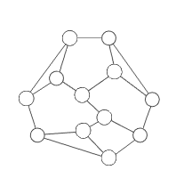
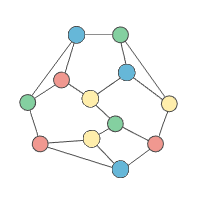

Given an undirected graph with maximum degree ↴ DD, find a graph coloring using at most D+1D+1 colors.


For example:



First described by Robert Frucht in 1939, the Frucht graph is a 3-regular graph with 12 vertices, 18 edges, and no nontrivial symmetries.
This graph's maximum degree (DD) is 3, so we have 4 colors (D+1D+1). Here's one possible coloring:



The Frucht graph with legal coloring.


Graphs are represented by an array of NN node objects, each with a label, a set of neighbors, and a color:
```

  class GraphNode {
  constructor(label) {
    this.label = label;
    this.neighbors = new Set();
    this.color = null;
  }
}

const a = new GraphNode('a');
const b = new GraphNode('b');
const c = new GraphNode('c');

a.neighbors.add(b);
b.neighbors.add(a);
c.neighbors.add(b);
b.neighbors.add(c);

const graph = [a, b, c];
```